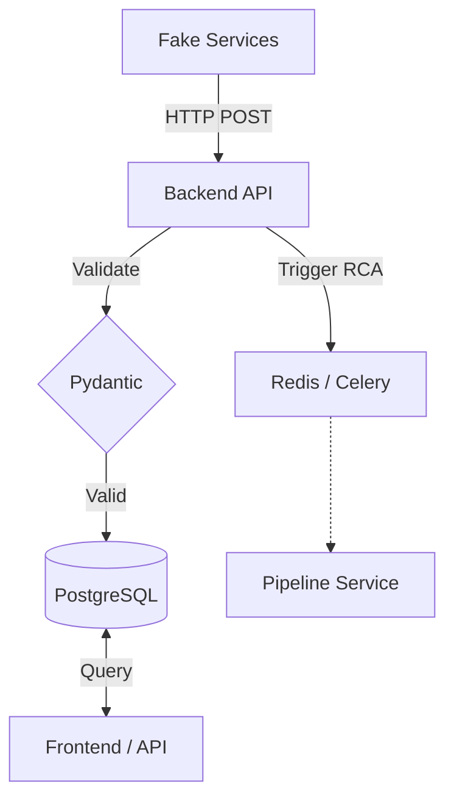

# ProdSentinel Backend

The **ProdSentinel Backend** is the high-performance ingestion and query engine for the ProdSentinel platform. It handles the receipt, validation, and persistent storage of all telemetry signals from distributed services and triggers the asynchronous analysis pipeline.

## Overview

The backend acts as the gateway to the ProdSentinel ecosystem. It provides async HTTP endpoints to accept logs, traces, and metrics, ensuring that telemetry ingestion never blocks the producing services. It also serves as the source of truth for the Query API used by the frontend.

## Features

- **Unified Incident Tracking**: Automatically tracks incidents for *all* signals, escalating severity based on rules.
- **Intelligent Triage**: Filters noise by only triggering expensive AI analysis for "Critical" or "High" severity events.
- **High-Throughput Ingestion**: Async-first architecture using FastAPI and SQLAlchemy (AsyncPG).
- **Signal Deduplication**: Client-side `signal_id` enforcement for idempotency.
- **Distributed Correlation**: Native support for `trace_id` shared across all signal types.
- **Analysis Triggering**: Automatically detects error signals and queues analysis tasks via Celery/Redis.
- **Distributed Lock**: Core implementation of Redis-based deduplication to prevent redundant analysis runs.
- **Immutable Store**: Append-only storage for raw telemetry to preserve audit trails.

## Tech Stack

- **Core**: Python 3.12+
- **Web Framework**: FastAPI
- **Database**: PostgreSQL with SQLAlchemy (Async)
- **Migrations**: Alembic
- **Task Ingestion**: Celery (client) & Redis
- **Validation**: Pydantic v2
- **Server**: Uvicorn

## 📂 Project Structure

```
prodsentinel-backend/
├── alembic/            # Database Migrations (Async)
├── app/
│   ├── core/           # Configuration, Database, Logging
│   ├── models/         # SQLAlchemy Models (Incident, Signal)
│   ├── routers/        # API Endpoints (Ingest, Query)
│   ├── schemas/        # Pydantic Schemas (Request/Response)
│   ├── services/       # Business Logic (Ingestion, Triage)
│   └── main.py         # Application Entrypoint
├── tests/              # Pytest Integration Tests
└── requirements.txt    # Python Dependencies
```

## Architecture (High Level)



## Setup / Installation

1. **Environment Setup**:
   ```bash
   uv venv
   source .venv/bin/activate
   uv pip install -r requirements.txt
   ```

2. **Database Initialization**:
   Ensure PostgreSQL is running, then apply migrations:
   ```bash
   uv run alembic upgrade head
   ```

3. **Redis Initialization**:
   Required for analysis triggering:
   ```bash
   docker run -d -p 6379:6379 redis:latest
   ```

## Configuration

Create a `.env` file based on `.env.example`:

| Variable | Description | Default |
|----------|-------------|---------|
| `DATABASE_URL` | PostgreSQL (asyncpg) connection string | Required |
| `REDIS_URL` | Redis for Celery task queuing | `redis://localhost:6379/0` |
| `LOG_LEVEL` | Logging verbosity (DEBUG, INFO) | `INFO` |

## Usage

### Run the Server
```bash
uv run uvicorn app.main:app --reload --port 8000
```

### Access Documentation
- **Swagger UI**: `http://localhost:8000/docs`
- **ReDoc**: `http://localhost:8000/redoc`

## API / Interfaces (Telemetry Specs)

The backend handles three primary signal types. Each key is crucial for downstream analysis.

### 1. Logs (`/ingest/logs`)

| Key | Type | Description |
|-----|------|-------------|
| `signal_id` | UUID | Client-generated unique ID for idempotency. |
| `trace_id` | String | Correlation ID for grouping related requests. |
| `service_name`| String | Source service emitting the log. |
| `timestamp` | ISO8601| Event occurrence time. |
| `level` | String | Severity: `INFO`, `ERROR`, `CRITICAL`. |
| `message` | String | Log message content. |
| `attributes` | Object | Metadata used by AI to find root causes. |

### 2. Traces (`/ingest/traces`)

| Key | Type | Description |
|-----|------|-------------|
| `signal_id` | UUID| Signal idempotency key. |
| `trace_id` | String| Shared ID for the whole request path. |
| `span_id` | String| Unique ID for this specific operation. |
| `parent_span_id`| String| ID of the calling operation. |
| `service_name` | String| Service name. |
| `name` | String| Operation name (e.g., `AUTHORIZE_PAYMENT`). |
| `start_time` | ISO8601| Operation start. |
| `end_time` | ISO8601| Operation end. |

### 3. Metrics (`/ingest/metrics`)

| Key | Type | Description |
|-----|------|-------------|
| `name` | String| Metric name (e.g., `http_request_duration`). |
| `value` | Float | Measured value. |
| `service_name` | String| Source service. |
| `timestamp` | ISO8601| Measurement time. |

## Testing

Run integration tests covering ingestion and query flows:

```bash
uv run pytest
```

Failure simulation tests (triggering RCA):
```bash
# Trigger a log that initiates a pipeline task
curl -X POST http://localhost:8000/ingest/logs -d '{... "level": "ERROR" ...}'
```
