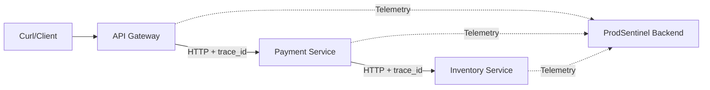

# ProdSentinel Fake Services

A collection of lightweight microservices designed to simulate production traffic, failure scenarios, and telemetry emission for the ProdSentinel platform.

## Overview

The `prodsentinel-fake-services` simulate a distributed e-commerce checkout flow. They are specifically designed to exercise the ProdSentinel Ingestion API and Analysis Pipeline by generating realistic, correlated signals across service boundaries.

## Features

- **Distributed Flow**: Simulates complex request paths (Gateway -> Payment -> Inventory).
- **Chaos Injection**: Deterministic failure modes for payment declines and inventory timeouts.
- **Trace Correlation**: Automatically propagates `trace_id` headers across all service hops.
- **Dual Telemetry**: Emits both local structured logs (for console/file) and remote telemetry logs (to ProdSentinel).
- **OpenTelemetry Integration**: Built-in support for distributed tracing spans.

## Tech Stack

- **Framework**: FastAPI
- **HTTP Client**: HTTPX (Async)
- **Logging**: Structlog (JSON structured logging)
- **Tracing**: OpenTelemetry SDK
- **Environment**: Python 3.12+

## 📂 Project Structure

```
prodsentinel-fake-services/
├── app/
│   ├── common/         # Shared Logging/Telemetry Logic
│   ├── api-gateway/    # Simulated Gateway Service
│   ├── payment-service/# Simulated Payment Service
│   └── inventory-service/# Simulated Inventory Service
├── scripts/            # Helper Scripts
└── requirements.txt    # Dependencies
```

## Architecture (High Level)



## Setup / Installation

1. **Environment Setup**:
   ```bash
   uv venv
   source .venv/bin/activate
   uv pip install -r requirements.txt
   ```

2. **Configuration**:
   Environment variables (optional):
   - `PRODSENTINEL_URL`: URL of the ingestion backend (Default: `http://localhost:8000`)

## Usage

Start the services using the provided batch scripts (Windows) or manual commands:

### Linux / Manual
```bash
# Start in separate terminals
uv run uvicorn app.api-gateway.main:app --port 8003
uv run uvicorn app.payment-service.main:app --port 8004
uv run uvicorn app.inventory-service.main:app --port 8002
```

### Windows
```powershell
.\run_api_gateway.bat
.\run_payment_service.bat
.\run_inventory_service.bat
```

## API / Interfaces

### API Gateway (Port 8003)
- `POST /checkout/success`: Simulates a successful checkout.
- `POST /checkout/order-fail-pay`: Simulates a payment failure (triggers ERROR logs).
- `POST /checkout/order-timeout`: Simulates an inventory timeout (cascading failure).

## Telemetry & Data Formats

Each service emits signals to ProdSentinel in a structured JSON format. Understanding these keys is essential for analysis correlation.

### 1. Telemetry Log Format (Sent to Ingestion API)

Emitted via `app/common/telemetry_sender.py` to `/ingest/logs`.

| Key | Type | Description |
|-----|------|-------------|
| `signal_id` | UUID | Unique identifier for this specific log event (Idempotency Key). |
| `trace_id` | String | Correlation ID shared across all services in a single request flow. |
| `service_name`| String | The service that produced the log (e.g., `api-gateway`). |
| `timestamp` | ISO8601| UTC timestamp when the event occurred. |
| `level` | String | Log severity: `INFO`, `WARNING`, `ERROR`, `CRITICAL`. |
| `message` | String | Human-readable description of the event. |
| `attributes` | Object | Arbitrary metadata (e.g., `order_id`, `latency_ms`, `error_code`). |

### 2. Local Structured Logs (Console)

Configured via `app/common/logging.py`. Uses `structlog` JSON renderer.

| Key | Description |
|-----|-------------|
| `timestamp` | ISO timestamp of the log. |
| `level` | Log level. |
| `event` | The log message. |
| `service` | Name of the service. |
| `request_id` | Correlation ID (maps to `trace_id`). |

### 3. Distributed Tracing

Uses standard **OpenTelemetry** spans. 
- **Baggage/Context**: Propagates `x-request-id` header as the correlation anchor.
- **Export**: Currently configured for `ConsoleSpanExporter` for easy debugging in service terminals.

## Testing / Failure Simulation

To verify ProdSentinel's analysis brain, trigger the following deterministic failures:

1. **Payment Decline**: 
   `curl -X POST http://localhost:8003/checkout/order-fail-pay`
   - **Expected**: Payment Service returns 500, emits `ERROR` log with `ValueError`.

2. **Inventory Timeout**:
   `curl -X POST http://localhost:8003/checkout/order-timeout`
   - **Expected**: Inventory Service hangs (simulated), Payment Service times out, Gateway returns 500.
