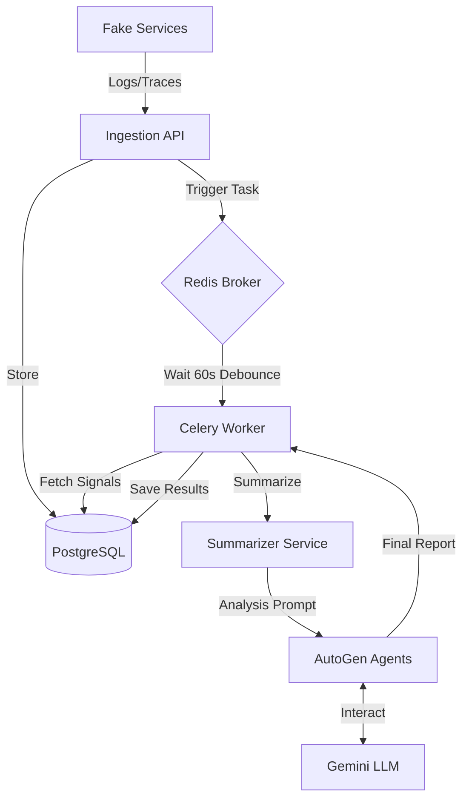

# ProdSentinel Pipeline

The **ProdSentinel Pipeline** is the asynchronous analysis engine of the ProdSentinel platform. It serves as the "brain," responsible for correlating raw signals, detecting incidents, and performing AI-powered root-cause analysis.

## Overview

The pipeline is triggered by the Ingestion service whenever an error or critical log is detected. It processes signals in the background to avoid blocking ingestion, using a combination of deterministic logic (for collection and summarization) and large language models (for qualitative analysis).

## Features

- **AI Severity Classification**: Auto-determines incident severity (Critical/High/Medium/Low) based on qualitative analysis, upgrading initial triage settings.
- **Asynchronous Processing**: Leverages Celery and Redis to handle analysis out-of-band.
- **Intelligent Summarization**: Automatically filters noise, truncates stack traces, and batches recurring errors to minimize LLM token usage.
- **Distributed Deduplication**: Prevents redundant analysis runs using a Redis-based distributed lock (`SETNX`) across multiple worker processes.
- **AI-Powered RCA**: Uses **AutoGen** multi-agent orchestration with **Google Gemini** to generate human-readable root-cause reports.
- **Persistence**: Automatically creates/updates `Incident` records and stores `AnalysisResult` metadata.

## Tech Stack

- **Core**: Python 3.12+
- **Task Queue**: Celery with Redis as broker
- **AI Orchestration**: AutoGen (Microsoft)
- **AI Model**: Google Gemini (Flash 1.5/2.5)
- **Database**: SQLAlchemy (Async) + PostgreSQL
- **Schema Management**: Pydantic v2
- **Management API**: FastAPI

## 📂 Project Structure

```
prodsentinel-pipeline/
├── app/
│   ├── services/       # Core Logic (Analyzer, Summarizer)
│   ├── tasks/          # Celery Task Definitions
│   ├── celery_app.py   # App & Broker Configuration
│   └── main.py         # Management API
├── tests/              # Verification Scripts
└── requirements.txt    # Dependencies (AutoGen, Celery)
```

## Architecture (High Level)



## Setup / Installation

1. **Environment Setup**:
   ```bash
   uv venv
   source .venv/bin/activate  # Or .venv\Scripts\activate on Windows
   uv pip install -r requirements.txt
   ```

2. **Database Connection**:
   Ensure PostgreSQL is running and accessible via the `DATABASE_URL` in your `.env`.

3. **Redis Setup**:
   Required for Celery task coordination:
   ```bash
   docker run -d -p 6379:6379 redis:latest
   ```

## Configuration

Create a `.env` file in the root based on `.env.example`:

| Variable | Description | Default |
|----------|-------------|---------|
| `GOOGLE_API_KEY` | Your Gemini API Key | Required |
| `DATABASE_URL` | PostgreSQL connection string | Required |
| `REDIS_URL` | Redis connection string | `redis://localhost:6379/0` |
| `LOG_LEVEL` | Logging verbosity | `INFO` |

## Usage

### Start Celery Worker

**Windows (Development):**
```bash
uv run celery -A app.celery_app worker --loglevel=info --pool=solo
```

**Linux/Docker:**
```bash
uv run celery -A app.celery_app worker --loglevel=info
```

### Start Management API (Optional)
Useful for manual triggers and health monitoring:
```bash
uv run uvicorn app.main:app --port 8001
```

## API / Interfaces

### Management API (Port 8001)

- `GET /health`: Basic health check.
- `POST /debug/analyze/{trace_id}`: Manually trigger analysis for a specific trace, bypassing the 60s debounce window.

### Task Interfaces

- **Task Name**: `analyze_trace`
- **Arguments**: `trace_id: str`
- **Behavior**: Single-task-per-trace enforcement via Redis.

## Testing

Run the integration verification suite to test summarization and AutoGen flow:

```bash
# Set PYTHONPATH to include the app directory
$env:PYTHONPATH="." 
uv run pytest tests/verify_phase3.py
```
